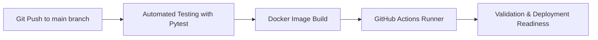

# DevOps-IndustrialCICD-Pipeline

End-to-end automated CI/CD pipeline for an industrial telemetry web API built with FastAPI, Pytest, Docker, and GitHub Actions. This project represents my learning journey from a blank canvas into the world of modern DevOps, QA automation, and software delivery workflows.


## Overview

This repository showcases a lightweight industrial telemetry API that simulates sensor/device monitoring with automated validation and deployment automation. It was created as a practical exercise to connect embedded systems thinking, backend development, and professional DevOps practices in one educational project.

The project demonstrates how a simple API can evolve from local development into a structured CI/CD pipeline with automated testing and container-based execution.

## System Architecture / CI-CD Flow



This workflow follows a simple but realistic engineering pipeline:

Git Push (Main Branch) -> Automated Testing (Pytest) -> Docker Image Build -> GitHub Actions Runner

## Tech Stack & Tools

### Backend / API
- Python 3.10
- FastAPI
- Uvicorn

### Testing / QA
- Pytest
- TestClient
- HTTPX

### DevOps / Containerization
- Docker
- GitHub Actions
- Ubuntu Linux runner

## Features & Highlights

- Industrial telemetry endpoints:
  - `GET /`
  - `GET /telemetry/{device_id}`
- Automated QA validation for API health checks and 404 error handling
- Lightweight containerization using `python:3.10-slim`
- CI/CD pipeline powered by GitHub Actions to run tests and build the Docker image automatically on push events
- Simple architecture suitable for learning, prototyping, and extension to real industrial monitoring systems

## My Learning Journey

### Phase 1: Initialization and Windows Environment Setup
I started from a blank repository and configured the project environment on Windows using Python Launcher (`py`) to ensure compatibility and smoother local development. This included preparing the project structure, repository initialization, and dependency management setup.

### Phase 2: FastAPI Telemetry Gateway Development
I built the API layer as a lightweight industrial telemetry service. The application exposes a base endpoint for status checks and a telemetry endpoint that returns mock device data for a valid device ID.

### Phase 3: Automated Test Suite Development
I implemented automated test cases using Pytest to validate API responses and ensure the application fails gracefully when a device is not found. This phase also involved dependency resolution around `httpx` and FastAPI test tooling.

### Phase 4: Dockerization
A Dockerfile was added to standardize the runtime environment, making the project portable and easier to validate in a containerized workflow.

### Phase 5: GitHub Actions CI/CD Workflow
I created a CI pipeline in `.github/workflows/ci-cd.yml` to automate the installation of dependencies, execution of tests, and Docker image build on each push to the main branch.

### Phase 6: Troubleshooting and Iteration
This stage involved real-world debugging and configuration work, including:
- adjusting Python execution commands using `py`
- fixing testing dependencies and package compatibility
- resolving Git remote configuration issues
- ensuring the pipeline configuration worked consistently across the repo

## Getting Started

### 1. Clone the repository

```bash
git clone https://github.com/Zhlsyh/DevOps-IndustrialCICD-Pipeline.git
cd DevOps-IndustrialCICD-Pipeline
```

### 2. Create a virtual environment and install dependencies

#### Windows
```bash
py -m venv .venv
.venv\Scripts\activate
py -m pip install --upgrade pip
py -m pip install -r requirements.txt
```

#### Linux / macOS
```bash
python3 -m venv .venv
source .venv/bin/activate
python -m pip install --upgrade pip
python -m pip install -r requirements.txt
```

### 3. Run automated tests

```bash
py -m pytest tests/
```

### 4. Run the API locally

```bash
py -m uvicorn app.main:app --reload
```

Then open:
- http://127.0.0.1:8000/
- http://127.0.0.1:8000/docs

### 5. Build and run with Docker

```bash
docker build -t industrial-telemetry-api:latest .
docker run -p 8000:8000 industrial-telemetry-api:latest
```

## Project Structure

```text
.
├── .github/
│   └── workflows/
│       └── ci-cd.yml
├── app/
│   └── main.py
├── tests/
│   └── test_api.py
├── .gitignore
├── dockerfile
├── README.md
├── requirements.txt
└── venv/
```

## API Endpoints

### `GET /`
Returns the service status.

Example response:
```json
{
  "status": "online",
  "message": "Industrial IoT Gateway active"
}
```

### `GET /telemetry/{device_id}`
Returns telemetry data for a valid device ID.

Example response:
```json
{
  "device_id": "ESP32_01",
  "temperature": 28.5,
  "status": "PASS"
}
```

## Author

- GitHub: [Zhlsyh](https://github.com/Zhlsyh)

This project is part of my portfolio journey focused on the intersection of software engineering, QA automation, and DevOps practices. It reflects my interest in building reliable systems, automating validation, and improving deployment quality through modern engineering workflows.

## License

This project is licensed under the [MIT License](LICENSE).
