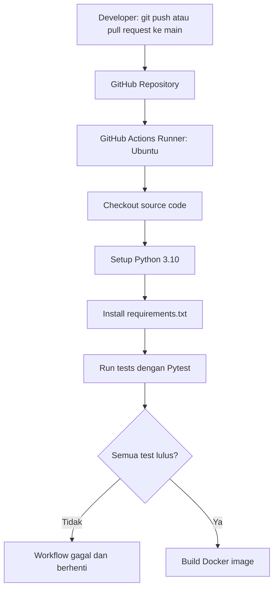

# 🚀 End-to-End Automated CI/CD Pipeline for Industrial Telemetry API


Repositori ini berisi proyek portofolio **Automated CI/CD Pipeline** untuk Web API telemetri IoT industri. Proyek ini saya mulai dari kanvas kosong di Windows untuk mempelajari proses pengembangan API, pengujian otomatis, containerization, dan workflow GitHub Actions.

Dengan latar belakang Teknik Elektronika Industri dan minat pada Embedded Systems, IoT, Computer Vision, serta Web/Backend Development, saya mengembangkan proyek ini sebagai latihan integrasi software engineering, QA automation, dan DevOps.

## 🛠️ Tech Stack & Tools

- **Backend API:** Python 3.10, FastAPI, Uvicorn
- **Automated Testing & QA:** Pytest, HTTPX, FastAPI TestClient
- **Containerization:** Docker dengan base image `python:3.10-slim`
- **CI/CD Automation:** GitHub Actions dengan Ubuntu runner
- **Version Control & Local OS:** Git, Windows CMD/PowerShell, Python Launcher `py`

## 🏗️ Arsitektur & Alur CI/CD

Setiap kali ada perubahan kode yang di-push atau pull request dibuat ke branch `main`, GitHub Actions menjalankan pipeline di runner Ubuntu:



Workflow menguji kode dan membangun image. Workflow ini belum mem-publish image ke registry atau men-deploy aplikasi.

## ✨ Fitur

- Endpoint `GET /` untuk memeriksa status API.
- Endpoint `GET /telemetry/{device_id}` untuk membaca telemetri simulasi `ESP32_01`.
- API mengembalikan HTTP `404` untuk device ID yang tidak dikenal.
- Automated tests memvalidasi respons API dan penanganan error `404`.
- GitHub Actions menjalankan tests sebelum membangun Docker image.
- Data telemetri masih statis, belum terhubung ke sensor fisik maupun database.

## 📝 Step-by-Step Perjalanan Pengerjaan

Berikut rangkuman proses pengembangan dari repository lokal hingga workflow CI berjalan. Perintah setup menggunakan Windows CMD, kecuali jika disebutkan lain.

### Step 1: Inisialisasi repository Git

Saya membuka folder proyek dan menginisialisasi Git:

```bat
cd C:\Users\Helmi\devops-cicd-pipeline
git init
git branch -M main
```

### Step 2: Membuat virtual environment dan memasang dependency

Saya menggunakan Python Launcher (`py`) untuk membuat environment dan memasang paket aplikasi serta testing:

```bat
py -m venv venv
venv\Scripts\activate
py -m pip install --upgrade pip
py -m pip install fastapi uvicorn pytest requests httpx
py -m pip freeze > requirements.txt
```

`requirements.txt` menyimpan versi paket agar dependency proyek bisa dipasang kembali.

### Step 3: Membuat struktur direktori

Saya menyiapkan folder aplikasi, test, dan workflow GitHub Actions:

```bat
mkdir app tests .github\workflows
```

### Step 4: Menulis API, test, Docker, dan workflow

Saya mengisi file proyek sesuai fungsinya:

- `app/main.py`: API FastAPI untuk status layanan dan telemetri simulasi `ESP32_01`.
- `tests/test_api.py`: test Pytest untuk respons sukses dan error `404`.
- `dockerfile`: instruksi Docker berbasis `python:3.10-slim`.
- `.github/workflows/ci-cd.yml`: konfigurasi workflow untuk memasang dependency, menjalankan test, dan membangun Docker image.

### Step 5: Menjalankan test dan troubleshooting

Saya menjalankan suite test dari terminal:

```bat
py -m pytest tests/
```

Hasil verifikasi lokal saat ini: **3 passed**. Dalam prosesnya saya juga memastikan dependency `httpx` tersedia untuk FastAPI TestClient.

### Step 6: Menambahkan dokumentasi dan aturan Git

Saya menambahkan `.gitignore` untuk mengabaikan environment lokal seperti `venv/`, bytecode Python, dan cache test. Environment sempat terunggah ke GitHub sebelum dikeluarkan dari versi repository yang aktif dengan:

```bat
git rm -r --cached venv
```

Perintah tersebut menghapus `venv/` dari index Git tanpa menghapus environment lokal. Saya juga menambahkan `LICENSE` MIT dan dokumentasi proyek ini.

### Step 7: Menghubungkan repository ke GitHub

Setelah membuat repository GitHub `DevOps-IndustrialCICD-Pipeline`, saya menambahkan remote, membuat commit awal, dan mengirim branch `main`:

```bat
git add .
git commit -m "docs & feat: initial commit with API, tests, Docker, and CI/CD workflow"
git remote add origin https://github.com/zhlsyh/DevOps-IndustrialCICD-Pipeline.git
git push -u origin main
```

Perintah `git remote add origin` hanya digunakan saat remote belum dikonfigurasi. Untuk clone yang sudah memiliki remote, periksa dengan `git remote -v` dan gunakan `git push origin main` untuk mengirim perubahan.

## Menjalankan Proyek Secara Lokal

Instruksi berikut mengasumsikan Git, Python 3.10, dan Docker (untuk langkah Docker) sudah tersedia. Jalankan perintah dari terminal.

### 1. Clone repository

```bash
git clone https://github.com/Zhlsyh/DevOps-IndustrialCICD-Pipeline.git
cd DevOps-IndustrialCICD-Pipeline
```

### 2. Buat virtual environment

Di Windows, gunakan PowerShell:

```powershell
py -3.10 -m venv .venv
.\.venv\Scripts\Activate.ps1
```

Jika menggunakan Command Prompt:

```bat
py -3.10 -m venv .venv
.\.venv\Scripts\activate.bat
```

Di Linux atau macOS:

```bash
python3.10 -m venv .venv
source .venv/bin/activate
```

Setelah aktivasi, prompt terminal biasanya menampilkan nama environment `.venv`.

### 3. Pasang dependency

Di Windows:

```powershell
py -m pip install --upgrade pip
py -m pip install -r requirements.txt
```

Di Linux atau macOS:

```bash
python -m pip install --upgrade pip
python -m pip install -r requirements.txt
```

### 4. Jalankan automated tests

Di Windows:

```powershell
py -m pytest tests/
```

Di Linux atau macOS:

```bash
python -m pytest tests/
```

Pytest akan menampilkan ringkasan test yang berhasil atau gagal di terminal.

### 5. Jalankan API

Di Windows:

```powershell
py -m uvicorn app.main:app --reload
```

Di Linux atau macOS:

```bash
python -m uvicorn app.main:app --reload
```

Saat server berjalan, coba endpoint berikut dari browser:

- API status: http://127.0.0.1:8000/
- Dokumentasi interaktif: http://127.0.0.1:8000/docs
- Telemetri device: http://127.0.0.1:8000/telemetry/ESP32_01

Untuk menghentikan server, tekan `Ctrl+C` di terminal.

### 6. Build dan jalankan dengan Docker

File Docker di repository saat ini bernama `dockerfile` (huruf kecil), jadi gunakan opsi `-f`:

```bash
docker build -f dockerfile -t industrial-telemetry-api:latest .
docker run --rm -p 8000:8000 industrial-telemetry-api:latest
```

Setelah container berjalan, buka http://127.0.0.1:8000/docs. Opsi `--rm` akan menghapus container setelah dihentikan. Tekan `Ctrl+C` untuk menghentikannya.

## Endpoint API

### `GET /`

Memeriksa status API.

Contoh respons:

```json
{
  "status": "online",
  "message": "Industrial IoT Gateway active"
}
```

### `GET /telemetry/{device_id}`

Mengambil data telemetri simulasi untuk device yang didukung.

Contoh request:

```text
GET /telemetry/ESP32_01
```

Contoh respons:

```json
{
  "device_id": "ESP32_01",
  "temperature": 28.5,
  "status": "PASS"
}
```

Untuk device ID yang tidak dikenal, API mengembalikan HTTP `404` dengan detail `Device not found`.

## 📁 Struktur Direktori Repository

```text
.
├── .github/
│   └── workflows/
│       └── ci-cd.yml
├── app/
│   └── main.py
├── tests/
│   └── test_api.py
├── .gitignore
├── dockerfile
├── LICENSE
├── README.md
└── requirements.txt
```

Virtual environment lokal (`.venv/` atau `venv/`) tidak disertakan dalam repository karena diabaikan oleh `.gitignore`.

## Author

**Zhlsyh**

GitHub: [github.com/Zhlsyh](https://github.com/Zhlsyh)

Proyek ini merupakan bagian dari portofolio saya dalam integrasi Software Engineering, QA Automation, dan DevOps, dengan latar belakang Teknik Elektronika Industri.

## License

Proyek ini menggunakan lisensi [MIT](LICENSE).
